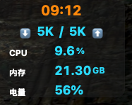

# NetworkSpeedMonitor



一个简洁美观的 macOS 菜单栏网络、CPU、内存、电池电量监控工具，支持窗口穿透、咖啡防睡眠、全局快捷键和完整的偏好设置系统。

## 功能特性

### 🖥️ 系统监控
- **网络速度**：实时显示下载/上传速度，格式为"⬇️12.3M/2.1M⬆️"，单位自动优化显示
- **CPU使用率**：全系统CPU占用率监控，采用差分算法，动态刷新
- **内存使用**：显示已用物理内存，单位自动调整（GB/MB）
- **电池电量**：实时显示电池电量百分比（无电池设备显示"--"）
- **时间显示**：本地时间（时:分），与咖啡模式图标居中显示

### 🎨 界面设计
- **简洁美观**：纵向排列，深色高透明圆角背景
- **可拖动**：窗口支持拖拽移动，自动记住位置
- **菜单栏集成**：原生菜单栏图标，支持深色模式
- **响应式**：所有监控指标单位美化，数值与单位分字号显示

### ⚙️ 偏好设置系统（v1.1.0 新增）
- **刷新频率**：可选择1秒/2秒/3秒/5秒/10秒更新间隔
- **显示内容**：自由选择显示/隐藏各个监控项目
  - 网络速度开关
  - CPU使用率开关
  - 内存使用开关
  - 电池电量开关
  - 时间显示开关
- **外观自定义**：
  - 背景透明度调节（0.3-0.8）
  - 颜色主题选择（蓝色/绿色/橙色）
- **窗口行为**：
  - 窗口置顶设置
  - 开机自启动选项
- **快捷键显示**：查看当前设置的全局快捷键

### ⌨️ 快捷键支持
- **Control+Option+Command+T**：随时显示/隐藏窗口
- **Control+Option+Command+K**：一键开启/关闭咖啡模式
- **Command+,**：打开偏好设置窗口

### 🔧 高级功能
- **窗口穿透**：可切换窗口是否响应鼠标操作
- **咖啡模式**：防止电脑睡眠和屏保，悬浮窗显示咖啡图标提示
- **异常处理**：网络异常时显示"--"，确保界面稳定
- **数据持久化**：所有偏好设置自动保存，重启后保持

## 📦 安装与使用

### 安装方式

1. **推荐方式：** 直接前往 [Releases 页面](https://github.com/fengerzh/network_speed_monitor_mac_native/releases) 下载最新版 DMG 安装包，双击挂载后将 NetworkSpeedMonitor 拖入 Applications 即可。

2. **开发者方式：** 如需自行编译：
   ```bash
   git clone https://github.com/fengerzh/network_speed_monitor_mac_native.git
   cd network_speed_monitor_mac_native
   swift build
   # 或使用 Xcode 打开项目进行编译
   ```

### 使用说明

1. **首次启动**：
   - 双击启动应用，或在 Launchpad/应用程序中启动
   - 悬浮窗会出现在屏幕右上角
   - 菜单栏会显示网络监控图标

2. **基本操作**：
   - **拖拽移动**：直接拖拽悬浮窗到任意位置
   - **菜单操作**：点击菜单栏图标访问功能菜单
   - **快捷键**：使用全局快捷键快速操作

3. **偏好设置**：
   - 通过菜单栏 → "偏好设置..." 或按 `⌘,` 打开设置窗口
   - 自定义显示内容、外观主题、刷新频率等
   - 所有设置立即生效并自动保存

4. **高级功能**：
   - **窗口穿透**：菜单栏 → "穿透" 切换鼠标穿透模式
   - **咖啡模式**：菜单栏 → "咖啡" 或 `⌃⌥⌘K` 防止系统睡眠
   - **显示/隐藏**：`⌃⌥⌘T` 快速显示/隐藏悬浮窗

## 🔄 更新日志

### v1.1.0 (2025-06-23)
- ✨ **新增完整的偏好设置系统**
  - 刷新频率自定义（1-10秒）
  - 显示内容自由选择
  - 外观主题和透明度调节
  - 窗口行为设置
- 🎨 **界面优化**
  - 支持颜色主题切换（蓝色/绿色/橙色）
  - 背景透明度可调节
  - 显示内容可自定义开关
- ⚙️ **功能增强**
  - 设置实时生效
  - 数据持久化存储
  - 完整的测试覆盖（69个测试）
- 🐛 **问题修复**
  - 修复Swift并发安全问题
  - 优化内存使用
  - 提升稳定性

### v1.0.3 及之前版本
- 基础监控功能
- 菜单栏集成
- 全局快捷键支持
- 咖啡模式和窗口穿透

## 🛠️ 技术栈

- **语言**：Swift 5.9+
- **框架**：Cocoa, AppKit
- **架构**：MVVM + Coordinator
- **测试**：XCTest (69个测试用例)
- **依赖管理**：Swift Package Manager
- **最低系统要求**：macOS 14.0+

## 📄 关于

- **软件名称**：NetworkSpeedMonitor
- **当前版本**：v1.1.0
- **作者**：zhangjing
- **开源协议**：MIT License
- **项目地址**：[GitHub](https://github.com/fengerzh/network_speed_monitor_mac_native)

## 🤝 贡献

欢迎提交 Issue 和 Pull Request！

1. Fork 本项目
2. 创建功能分支 (`git checkout -b feature/AmazingFeature`)
3. 提交更改 (`git commit -m 'Add some AmazingFeature'`)
4. 推送到分支 (`git push origin feature/AmazingFeature`)
5. 打开 Pull Request

## 📝 开源协议

本项目采用 MIT 协议 - 查看 [LICENSE](LICENSE) 文件了解详情。